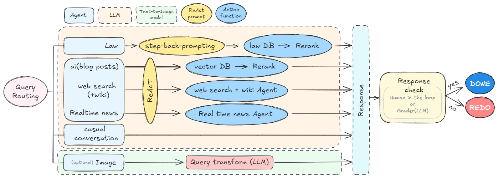
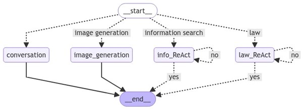
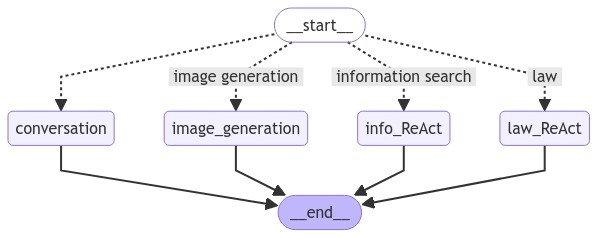

```
Multi_Agent_Chat_System/
├── agents
│   ├── ai.py
│   ├── conversation.py
│   ├── image.py
│   ├── __init__.py
│   ├── law.py
│   ├── realtime.py
│   └── web_search.py
├── app
│   ├── app.py
│   ├── __init__.py
│   └── streamlit.py
├── config.py
├── db
│   ├── data_processing.py
│   ├── db_management.py
│   ├── __init__.py
│   └── retrieve.py
├── formats.py
├── graph
│   ├── graph.py
│   ├── __init__.py
│   └── node.py
├── HITL
│   ├── hitl.py
│   └── __init__.py
├── main.py
├── model
│   ├── __init__.py
│   └── model_prep.py
├── react
│   ├── info.py
│   ├── __init__.py
│   ├── law.py
│   ├── loop.py
│   └── prompt.py
└── tools
    ├── function_call.py
    ├── __init__.py
    └── tool.py
```
# Multi Agent Chat System (ReAct + HITL + Text-to-Image)

- Agents:
  - Law
  - Ai
  - Realtime
  - Web search
  - Casual converstaion
  - Image generation
    
<center></center>

## Include REDO pipeline

<center></center>

## Exclude REDO pipeline

<center></center>
